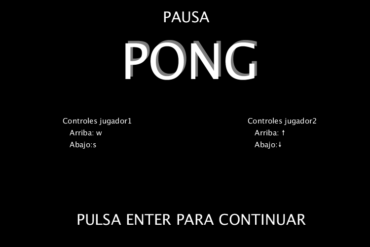

# Pong

## Autor

Héctor Henríquez Cabrera

Correo: <hector.henriquez101@alu.ulpgc.es>

Asignatura: Creando Interfaces de Usuario (CIU)

## Introducción

En esta primera práctica se ha compuesto una aplicación mediante **processing 3** un juego muy similar al clásico Pong. Es un juego de dos jugadores, los cuales deben intentar llevar la pelota al final del campo del rival mediante el rebote de la pelota ocasionado por la pala que se controla. En la partida se puede controlar la dirección de la bola mediante el movimiento que se haga para golpear la pelota, esto quiere decir que si impulsas la raqueta con fuerza hacía arriba la bola tomará esa trayectoria en el eje y, en el eje x aumentará la velocidad poco a poco a medida de que vaya rebotando en las palas de los jugadores, con lo que añade un poco más de rapidez los juegos, ya que cuanta más velocidad adquiera, más habilidad requiere devolver la pelota al rival.

**En el caso de ser usuario de Windows, para interactuar hace falta hacer focus en la pantalla haciendo clic sobre la aplicación.**

## Demo

En la demo se puede observar el menú principal, junto a una partida entre dos jugadores. En dicha partida se puede observar la trayectoria de la bola frente al comportamiento de las palas de los jugadores.

## Implementación

### Librerías

Para la implementación de este juego se ha usado solo la librería **Processing sound** debido a que era necesario para la inclusión de los sonidos de la aplicación, a su vez no se ha incluido la librería **GifAnimation**, ya que solo iba a ser usado para la inclusión del gif que serviría de demo, por lo que cuando se fuese a replicar en otro sistema este sería totalmente inútil.

### Diseño

Para el diseño de esta aplicación se ha optado por dejar la interfaz lo más clara posible, ya que una interfaz demasiado complicada o muy intrusiva dificultaría el uso y disfrute del juego. Por lo que solo se dispuso los elementos más básicos en su vista principal:

* Dos marcadores con la puntuación de cada jugador.
* Línea que separa un los campos de los jugadores.
* Las raquetas de cada jugador.
* La pelota.

Una vez teniendo esto era necesario una guía para explicar los controles a los jugadores que nunca hayan tenido experiencia con el juego. La solución encontrada fue insertar dicha guía en un menú de pausa, el cual mostraría a cada jugador los controles asociados a cada uno. Además esta vista es la inicial una vez se empieza el juego, por lo que deja claro como usar la aplicación desde un principio.

Se añadió como extra una vista de pausa que serviría de menú. En el cual se podría apreciar el título del juego y los controles asociados a cada jugador. Este menú cada vez que se accede a él pausa el juego, esto quiere decir que tiene la funcionalidad de detener el juego siempre que se quiera.

Por último la paleta escogida han sido en su mayoría en blanco y negro para simular el juego original del Pong, el cual estaba compuesto también de esta paleta de colores.

### Funcionalidades

Las funcionalidades básicas implementadas han sido: 

* Rebote de la pelota con una superficie.
* Contador de puntuación de cada jugador.
* Reproducción de sonido cuando la pelota rebota en una superficie o se anota un gol.
* Control independiente de cada raqueta.
* Dirección de la pelota aleatoria al inicio de la partida.

Las funcionalidades extra han sido:

* Menú con instrucciones.
* Pausa del juego.
* Control de la dirección de la pelota.
* Aumento de la velocidad de la pelota a medida de que el juego avanza.

## Interrupciones

Todas las interrupciones manejadas en este programa han sido mediante teclado, por lo que se han manejado las interrupciones generadas mediante la función **keyPressed** y la función **keyReleased**. Las teclas y acciones consecuentes que las activan son:

| Tecla |                          Uso                          |
| :---: | :---------------------------------------------------: |
| ENTER | Pausar el juego mostrando el menú o reanudar el juego |
|   w   |      Mover hacia arriba la raqueta del jugador 1      |
|   s   |      Mover hacia abajo la raqueta del jugador 1       |
|   ↑   |      Mover hacia arriba la raqueta del jugador 2      |
|   ↓   |      Mover hacia abajo la raqueta del jugador 2       |

## Bibliografía

- [Guion de prácticas](https://cv-aep.ulpgc.es/cv/ulpgctp20/pluginfile.php/126724/mod_resource/content/22/CIU_Pr_cticas.pdf)
- [processing.org](https://processing.org/)